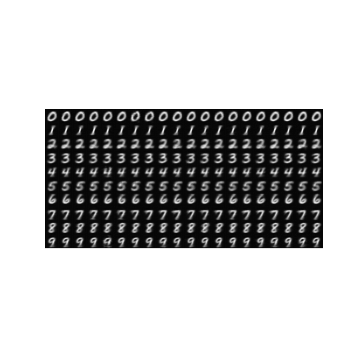
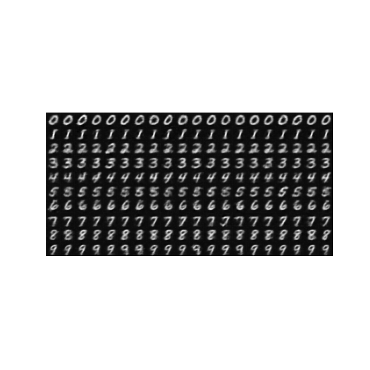

# conditional-vae
Tensorflow implementations of (Conditional) Variational Autoencoder concepts

### Usage
```
cd {simple-vae|conditional-vae}/src
python main.py
```
VAE settings (&beta; and latent dimension) can easily be modified inside main.py.


### Simple VAE Experiments

In experiments below, latent space visualization is obtained by TSNE on encoder outputted means for each sample in the training set.

#### KL Loss vs. Reconstruction Loss
+ &beta; = 0.0 (optimising only reconstruction loss): Latent space idea is not used because encoder can put each sample in separate places with punctual variations. Test image reconstruction quality is high even if they are not used in training, but generation ability is very low.
<table align='center'>
<tr align='center'>
<td> 2d latent space </td>
<td> reconstructed test set images </td>
<td> Inewly generated images </td>
</tr>
<tr>
<td>
<td>
<td>
</tr>
</table>

+ &beta; = 200.0 (optimising only kl loss): Without reconstruction pressure, all samples will have unit gaussian parameters, thus in the latent space no label(or similarity)-based clustering will be observed. Test image reconstruction quality, and generation ability are very low.
<table align='center'>
<tr align='center'>
<td> 2d latent space </td>
<td> reconstructed test set images </td>
<td> Inewly generated images </td>
</tr>
<tr>
<td>
<td>
<td>
</tr>
</table>


+ &beta; = 12.0 (optimising both losses): Both clustering nature of reconstruction loss and dense packing nature of kl loss observed.
<table align='center'>
<tr align='center'>
<td> 2d latent space </td>
<td> digit manifold when latent dimension = 2 </td>
</tr>
<tr>
<td>
<td>
</tr>
</table>

### Conditional VAE Experiments

Instead of having one normal distribution where each digit tries to find a place for itself, with the label conditioning, now each digit has its own Gaussian distribution. Thus, 2d latent space concept is no longer valid, but this is compansated by the option of producing desired digit. For the following experiments, even though I tried with various architectures, enough variation is not present. I observed the same problem for different implementations such as in [this](https://github.com/MINGUKKANG/CVAE).
<table align='center'>
<tr align='center'>
<td> &beta; = 1.0 </td>
<td> &beta; = 1e-11 </td>
</tr>
<tr>
<td>
<td>
</tr>
</table>

### Model
+ simple-vae: Both encoder and decoder consist of two fully connected hidden layers.
+ conditional-vae: Encoder consists of two convolutional layers. One-hot label vector concatenated on the flattened output of these. For decoder, after sampling, one hot vector concatenation applied. Decoder consists of 3 transposed convolution layers, where the final single feature map is decoded image.

### Implementation Details
Various ways of VAE implementation is possible in TF, but I computed both losses after forward pass, which means model provides both encoder and decoder outputs.

Training is done on MNIST training set, using Adam optimizer with learning rate 1e-3 for maximum of 15 epochs. Depending on latent channel capacity, overfitting is possible, so early stopping via visual inspection is advised.

I experimented with different formulations of re-parametrization trick and found that z = &mu; + &sigma; &#8857; &epsilon; is less stable than z = &mu; + log(1 + exp(&rho;)) &#8857; &epsilon;, although both produce nice outcomes. 
